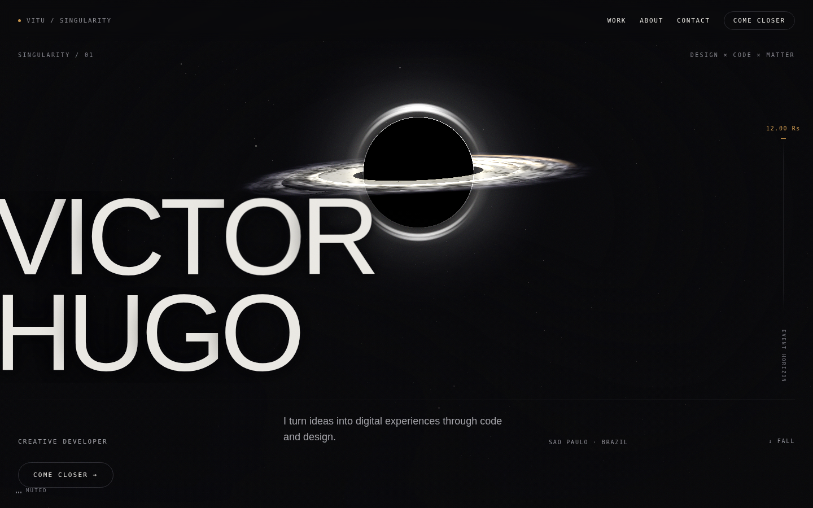

# Singularity — Victor Hugo's portfolio



Personal portfolio built around one concept: **gravity**. A real-time black hole
is not a background decoration; it is the site's main character. It bends the
hero typography, shapes the star field, recedes while each case study gets its
own visual world, and returns for the closing sequence.

The portfolio presents three selected products: **Emprega.co**, **Doces da
Pati**, and **HelpPet**. All public-facing copy is written in English for an
international audience.

## Stack

- **React 18** + **TypeScript** + **Vite**
- **Three.js** / **@react-three/fiber** — a cena é procedural, não um asset
- **GSAP** + **ScrollTrigger** — timelines scrubadas
- **Lenis** — scroll suave, com um único frame loop para tudo
- **styled-components**

## Local development

```bash
npm install
npm run dev
```

Production checks:

```bash
npm run build      # tsc --noEmit + vite build
npm test
npm run typecheck
npm run lint
npm run format:check
npm run preview
```

## Structure

```
src/
  components/
    layout/       HUD, grain, redshift, cursor, 3D stage, sound toggle
    navigation/   header
    providers/    SmoothScrollProvider — the application's single frame loop
    sections/     Hero, Work, About, Skills, Contact
  hooks/          horizontal scroll, intro, gravity field, collapse
  lib/            content and the shared interaction domains
  three/          procedural scene, adaptive render quality, star field
  styles/         design tokens and global styles
docs/
  ARCHITECTURE.md technical decisions and their evidence
  BUGS-ABERTOS.md known defects and the evidence needed to close them
  V1-SPEC.md      approved launch scope and acceptance criteria
  reference/      source prototype for the 3D scene
public/
  victor-2010.jpg portrait used in About
```

## The 3D scene

The black hole is generated in `src/three/singularityScene.ts`. A GLB version
was tested and rejected because glTF did not preserve the additive blending,
HDR vertex colors, lens-halo billboard, and core mask that define the object.

The source prototype is
[`docs/reference/black-hole.html`](docs/reference/black-hole.html), and seed
`1337` keeps the geometry deterministic. Geometry density, DPR, antialiasing,
and framing adapt across high, balanced, and low device tiers. The low tier is
the mobile baseline rather than a degraded afterthought.

See [`docs/ARCHITECTURE.md`](docs/ARCHITECTURE.md) for the invariants.

## Content model

Project facts, links, highlights, and page copy live in `src/lib/content.ts`.
The UI does not duplicate project claims. Branded case-study surfaces are
deliberately presented as editorial compositions, not product screenshots.

The contact CTA opens a prefilled email to `eovitu7@gmail.com`; there is no
mock chat or form pretending to submit data.

## Scroll and intro

One clock drives the site: `Lenis → GSAP ticker → ScrollTrigger → animations →
R3F`. The canvas uses `frameloop="never"` and does not create a second permanent
render loop.

The launch gate waits for actual font and WebGL readiness, with a bounded safety
timeout. Reload choreography still has a 3.2-second ceiling and returns the
reader to the hero.

## Accessibility

- Semantic landmarks and a keyboard-accessible skip link.
- Visible focus treatment and keyboard navigation for interactive modules.
- Complete `prefers-reduced-motion` paths for the intro and motion systems.
- English metadata, descriptive labels, and touch-friendly controls.

These are implemented safeguards, not a claim of formal accessibility
certification.

## License

MIT — see [LICENSE](LICENSE).
